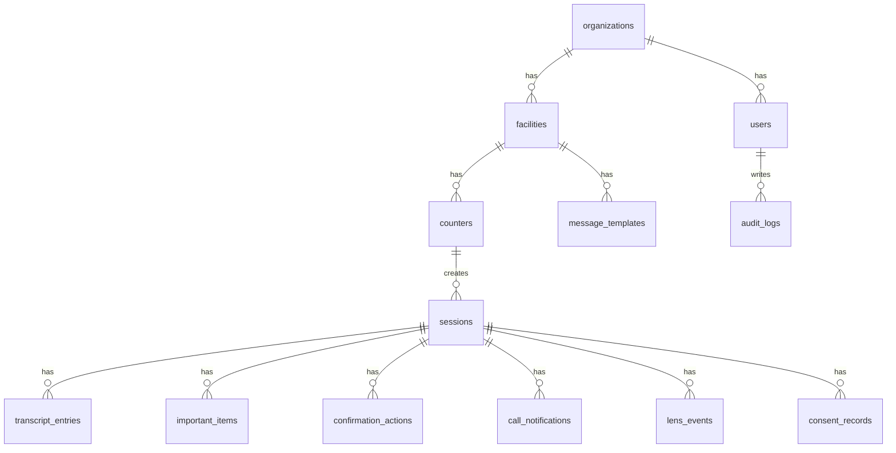

# DB設計書 MVP

## 1. 文書情報

| 項目 | 内容 |
|---|---|
| プロジェクト名 | Mieru Counter |
| 対象フェーズ | MVP |
| 想定DB | PostgreSQL |
| 開発時代替 | SQLite可 |
| 作成日 | 2026-06-27 |

## 2. DB設計方針

MVPでは、窓口セッションを中心にデータを設計する。

設計方針:

- 施設ごとにデータを分離できること
- 会話ログ、重要事項カード、確認ボタン履歴をセッション単位で追えること
- 利用者の個人情報は最小限にすること
- AI抽出結果とスタッフ確認済みデータを分けること
- 将来のEven G2実機連携に備えてLens表示イベントを分離すること
- 本番化時に監査ログ、保存期間、削除対応を追加しやすくすること

## 3. エンティティ概要



## 4. テーブル一覧

| テーブル | 用途 |
|---|---|
| organizations | 導入法人、自治体、薬局チェーン |
| facilities | 店舗、薬局、診療所、役所庁舎など |
| counters | 窓口、受付、薬局カウンター |
| users | スタッフ、管理者 |
| sessions | 利用者との窓口セッション |
| consent_records | 録音・保存・利用同意の記録 |
| transcript_entries | 字幕ログ |
| important_items | 重要事項カード |
| confirmation_actions | 利用者の確認ボタン履歴 |
| message_templates | 定型文 |
| call_notifications | 呼び出し番号、案内通知 |
| lens_events | Lens Preview / Even G2表示イベント |
| audit_logs | 監査ログ |

## 5. 共通カラム方針

全主要テーブルに以下を持たせる。

| カラム | 型 | 内容 |
|---|---|---|
| id | uuid | 主キー |
| created_at | timestamptz | 作成日時 |
| updated_at | timestamptz | 更新日時 |

削除は原則ソフトデリートを検討する。

| カラム | 型 | 内容 |
|---|---|---|
| deleted_at | timestamptz nullable | 削除日時 |

MVPでは削除処理が複雑になりすぎる場合、履歴系テーブルは物理削除せず、参照停止で対応する。

## 6. テーブル定義

### 6.1 organizations

導入法人、自治体、薬局チェーンなどの親組織。

| カラム | 型 | 必須 | 内容 |
|---|---|---:|---|
| id | uuid | yes | 組織ID |
| name | text | yes | 組織名 |
| organization_type | text | yes | pharmacy_chain, clinic_group, municipality, company |
| status | text | yes | active, suspended |
| contact_email | text | no | 管理連絡先 |
| created_at | timestamptz | yes | 作成日時 |
| updated_at | timestamptz | yes | 更新日時 |

インデックス:

- organizations(status)

### 6.2 facilities

実際の利用拠点。

| カラム | 型 | 必須 | 内容 |
|---|---|---:|---|
| id | uuid | yes | 施設ID |
| organization_id | uuid | yes | 組織ID |
| name | text | yes | 施設名 |
| facility_type | text | yes | pharmacy, clinic, city_office, bank, hotel |
| address | text | no | 住所 |
| phone | text | no | 電話番号 |
| status | text | yes | active, suspended |
| settings_json | jsonb | no | 施設設定 |
| created_at | timestamptz | yes | 作成日時 |
| updated_at | timestamptz | yes | 更新日時 |

インデックス:

- facilities(organization_id)
- facilities(facility_type)
- facilities(status)

### 6.3 counters

窓口単位。

| カラム | 型 | 必須 | 内容 |
|---|---|---:|---|
| id | uuid | yes | 窓口ID |
| facility_id | uuid | yes | 施設ID |
| name | text | yes | 窓口名 |
| counter_code | text | no | 窓口コード |
| qr_token | text | yes | 接続用QRトークン |
| status | text | yes | active, inactive |
| created_at | timestamptz | yes | 作成日時 |
| updated_at | timestamptz | yes | 更新日時 |

インデックス:

- counters(facility_id)
- counters(qr_token) unique

### 6.4 users

スタッフ、管理者。

| カラム | 型 | 必須 | 内容 |
|---|---|---:|---|
| id | uuid | yes | ユーザーID |
| organization_id | uuid | yes | 組織ID |
| facility_id | uuid | no | 所属施設ID |
| name | text | yes | 表示名 |
| email | text | yes | メール |
| role | text | yes | owner, admin, manager, staff |
| password_hash | text | no | パスワードハッシュ |
| status | text | yes | active, invited, suspended |
| last_login_at | timestamptz | no | 最終ログイン |
| created_at | timestamptz | yes | 作成日時 |
| updated_at | timestamptz | yes | 更新日時 |

インデックス:

- users(organization_id)
- users(facility_id)
- users(email) unique
- users(role)

### 6.5 sessions

利用者との窓口セッション。

| カラム | 型 | 必須 | 内容 |
|---|---|---:|---|
| id | uuid | yes | セッションID |
| organization_id | uuid | yes | 組織ID |
| facility_id | uuid | yes | 施設ID |
| counter_id | uuid | yes | 窓口ID |
| staff_user_id | uuid | no | 担当スタッフID |
| session_code | text | yes | 利用者接続コード |
| status | text | yes | waiting, active, ended, expired |
| visitor_label | text | no | 利用者表示名。匿名可 |
| language | text | yes | ja, en, zh, koなど |
| started_at | timestamptz | no | 開始日時 |
| ended_at | timestamptz | no | 終了日時 |
| expires_at | timestamptz | yes | 有効期限 |
| metadata_json | jsonb | no | 追加情報 |
| created_at | timestamptz | yes | 作成日時 |
| updated_at | timestamptz | yes | 更新日時 |

インデックス:

- sessions(organization_id, created_at)
- sessions(facility_id, created_at)
- sessions(counter_id, status)
- sessions(session_code) unique
- sessions(status)

### 6.6 consent_records

同意記録。

| カラム | 型 | 必須 | 内容 |
|---|---|---:|---|
| id | uuid | yes | 同意ID |
| session_id | uuid | yes | セッションID |
| consent_type | text | yes | transcript_save, audio_recording, ai_processing, family_share |
| consented | boolean | yes | 同意有無 |
| consent_text_version | text | yes | 同意文バージョン |
| consented_at | timestamptz | yes | 同意日時 |
| revoked_at | timestamptz | no | 撤回日時 |
| created_at | timestamptz | yes | 作成日時 |

インデックス:

- consent_records(session_id)
- consent_records(consent_type)

### 6.7 transcript_entries

字幕ログ。

| カラム | 型 | 必須 | 内容 |
|---|---|---:|---|
| id | uuid | yes | 字幕ID |
| session_id | uuid | yes | セッションID |
| speaker_type | text | yes | staff, visitor, system |
| speaker_name | text | no | 話者名 |
| source | text | yes | manual, speech_to_text, template, system |
| original_text | text | yes | 元テキスト |
| display_text | text | yes | 表示用短文 |
| language | text | yes | 言語 |
| confidence | numeric | no | 音声認識信頼度 |
| sequence_no | integer | yes | セッション内順序 |
| created_by_user_id | uuid | no | 作成スタッフ |
| created_at | timestamptz | yes | 作成日時 |

インデックス:

- transcript_entries(session_id, sequence_no)
- transcript_entries(session_id, created_at)
- transcript_entries(source)

### 6.8 important_items

重要事項カード。

| カラム | 型 | 必須 | 内容 |
|---|---|---:|---|
| id | uuid | yes | 重要事項ID |
| session_id | uuid | yes | セッションID |
| source_transcript_entry_id | uuid | no | 元字幕ID |
| item_type | text | yes | medicine, appointment, payment, place, document, warning, next_action, other |
| title | text | yes | タイトル |
| body | text | yes | 本文 |
| priority | text | yes | normal, high, urgent |
| extraction_source | text | yes | rule, ai, staff_manual |
| review_status | text | yes | candidate, staff_confirmed, sent, dismissed |
| reviewed_by_user_id | uuid | no | 確認スタッフ |
| sent_at | timestamptz | no | 利用者送信日時 |
| display_until | timestamptz | no | 表示期限 |
| metadata_json | jsonb | no | 薬の回数など構造化情報 |
| created_at | timestamptz | yes | 作成日時 |
| updated_at | timestamptz | yes | 更新日時 |

インデックス:

- important_items(session_id, review_status)
- important_items(session_id, item_type)
- important_items(priority)

metadata_json例:

```json
{
  "medicine_name": "薬A",
  "dosage": "1錠",
  "frequency": "1日3回",
  "timing": "食後",
  "date": "2026-07-15",
  "time": "10:00"
}
```

### 6.9 confirmation_actions

利用者の確認ボタン履歴。

| カラム | 型 | 必須 | 内容 |
|---|---|---:|---|
| id | uuid | yes | 確認アクションID |
| session_id | uuid | yes | セッションID |
| action_type | text | yes | understood, repeat, slower, write_text, sign_language, help |
| target_type | text | no | transcript, important_item, session |
| target_id | uuid | no | 対象ID |
| message | text | no | 補足メッセージ |
| handled_by_user_id | uuid | no | 対応スタッフ |
| handled_at | timestamptz | no | 対応日時 |
| created_at | timestamptz | yes | 作成日時 |

インデックス:

- confirmation_actions(session_id, created_at)
- confirmation_actions(action_type)
- confirmation_actions(handled_at)

### 6.10 message_templates

定型文。

| カラム | 型 | 必須 | 内容 |
|---|---|---:|---|
| id | uuid | yes | 定型文ID |
| organization_id | uuid | yes | 組織ID |
| facility_id | uuid | no | 施設ID |
| category | text | yes | reception, medicine, payment, document, guidance |
| title | text | yes | 定型文名 |
| body | text | yes | 送信本文 |
| easy_japanese_body | text | no | やさしい日本語 |
| language | text | yes | 言語 |
| is_active | boolean | yes | 有効 |
| sort_order | integer | yes | 表示順 |
| created_at | timestamptz | yes | 作成日時 |
| updated_at | timestamptz | yes | 更新日時 |

インデックス:

- message_templates(organization_id, category)
- message_templates(facility_id)
- message_templates(is_active)

### 6.11 call_notifications

呼び出し番号や案内通知。

| カラム | 型 | 必須 | 内容 |
|---|---|---:|---|
| id | uuid | yes | 通知ID |
| session_id | uuid | yes | セッションID |
| counter_id | uuid | no | 窓口ID |
| call_number | text | no | 呼び出し番号 |
| title | text | yes | タイトル |
| body | text | yes | 本文 |
| priority | text | yes | normal, high, urgent |
| sent_by_user_id | uuid | no | 送信スタッフ |
| sent_at | timestamptz | yes | 送信日時 |
| created_at | timestamptz | yes | 作成日時 |

インデックス:

- call_notifications(session_id, sent_at)
- call_notifications(counter_id, sent_at)

### 6.12 lens_events

Lens PreviewまたはEven G2へ送った表示イベント。

| カラム | 型 | 必須 | 内容 |
|---|---|---:|---|
| id | uuid | yes | LensイベントID |
| session_id | uuid | yes | セッションID |
| adapter_type | text | yes | mock, even_g2 |
| mode | text | yes | caption, important, call, confirm |
| title | text | no | タイトル |
| body | text | yes | 表示本文 |
| priority | text | yes | normal, high, urgent |
| actions_json | jsonb | no | 選択肢 |
| delivery_status | text | yes | queued, sent, failed |
| error_message | text | no | エラー内容 |
| sent_at | timestamptz | no | 送信日時 |
| created_at | timestamptz | yes | 作成日時 |

インデックス:

- lens_events(session_id, created_at)
- lens_events(delivery_status)
- lens_events(adapter_type)

### 6.13 audit_logs

監査ログ。

| カラム | 型 | 必須 | 内容 |
|---|---|---:|---|
| id | uuid | yes | 監査ログID |
| organization_id | uuid | yes | 組織ID |
| facility_id | uuid | no | 施設ID |
| actor_user_id | uuid | no | 操作ユーザー |
| action | text | yes | 操作種別 |
| resource_type | text | yes | 対象種別 |
| resource_id | uuid | no | 対象ID |
| ip_address | text | no | IPアドレス |
| user_agent | text | no | User-Agent |
| metadata_json | jsonb | no | 追加情報 |
| created_at | timestamptz | yes | 作成日時 |

インデックス:

- audit_logs(organization_id, created_at)
- audit_logs(actor_user_id, created_at)
- audit_logs(resource_type, resource_id)

## 7. Enum案

### session_status

- waiting
- active
- ended
- expired

### important_item_type

- medicine
- appointment
- payment
- place
- document
- warning
- next_action
- other

### review_status

- candidate
- staff_confirmed
- sent
- dismissed

### confirmation_action_type

- understood
- repeat
- slower
- write_text
- sign_language
- help

### lens_mode

- caption
- important
- call
- confirm

### priority

- normal
- high
- urgent

## 8. 初期ERの考え方

セッションを中心に、以下のようにデータを扱う。

1. スタッフが`sessions`を作成
2. 会話文は`transcript_entries`に蓄積
3. 抽出候補は`important_items.review_status = candidate`で作成
4. スタッフ確認後、`staff_confirmed`または`sent`になる
5. 利用者のボタン操作は`confirmation_actions`に残る
6. G2またはLens Previewに送った内容は`lens_events`に残る

## 9. データ保持方針

MVP推奨:

| データ | 保存期間 |
|---|---|
| セッション基本情報 | 90日 |
| 字幕ログ | 30日 |
| 重要事項カード | 90日 |
| 確認ボタン履歴 | 90日 |
| 監査ログ | 1年 |

本番化時には施設ごとに保存期間を設定できるようにする。

## 10. 個人情報最小化

MVPでは以下を避ける。

- 利用者の本名保存
- 診断名の構造化保存
- 保険証番号
- マイナンバー
- 決済情報
- 音声データの長期保存

必要な場合は、セッション単位の匿名ラベルで管理する。

例:

- 利用者A
- 受付番号15
- 本日3人目

## 11. インデックス方針

頻繁に使う検索:

- 施設ごとの現在セッション
- セッション内の字幕ログ
- セッション内の重要事項カード
- 未対応の確認ボタン
- 施設別のセッション履歴

推奨インデックス:

```sql
create index idx_sessions_facility_status
  on sessions (facility_id, status, created_at desc);

create index idx_transcript_entries_session_sequence
  on transcript_entries (session_id, sequence_no);

create index idx_important_items_session_status
  on important_items (session_id, review_status);

create index idx_confirmation_actions_session_created
  on confirmation_actions (session_id, created_at desc);

create index idx_lens_events_session_created
  on lens_events (session_id, created_at desc);
```

## 12. MVP用の最小DB構成

開発初期に最小で始めるなら、以下だけでもよい。

1. organizations
2. facilities
3. counters
4. users
5. sessions
6. transcript_entries
7. important_items
8. confirmation_actions
9. message_templates
10. lens_events

consent_records、call_notifications、audit_logsは、MVP後半または実証前に追加する。

## 13. API設計との対応

| API | 主なテーブル |
|---|---|
| POST /api/sessions | sessions |
| GET /api/sessions/:id | sessions, transcript_entries, important_items |
| POST /api/sessions/:id/transcripts | transcript_entries, lens_events |
| POST /api/sessions/:id/extract | important_items |
| PATCH /api/important-items/:id | important_items |
| POST /api/important-items/:id/send | important_items, lens_events |
| POST /api/sessions/:id/confirmations | confirmation_actions |
| GET /api/templates | message_templates |
| POST /api/sessions/:id/call | call_notifications, lens_events |

## 14. 将来拡張

将来的に追加する可能性があるテーブル:

- ai_processing_jobs
- speech_recognition_jobs
- translations
- family_shares
- facility_reports
- device_registrations
- notification_subscriptions
- integration_connections
- data_deletion_requests

## 15. 注意点

- AI抽出結果は、必ずスタッフ確認状態を持たせる
- Lens表示イベントはログとして残し、実機送信失敗を追えるようにする
- 会話ログは便利だが個人情報リスクが高いため、保存期間と削除導線を必ず設計する
- 本番化時は施設ごとのデータアクセス制御を厳格にする

