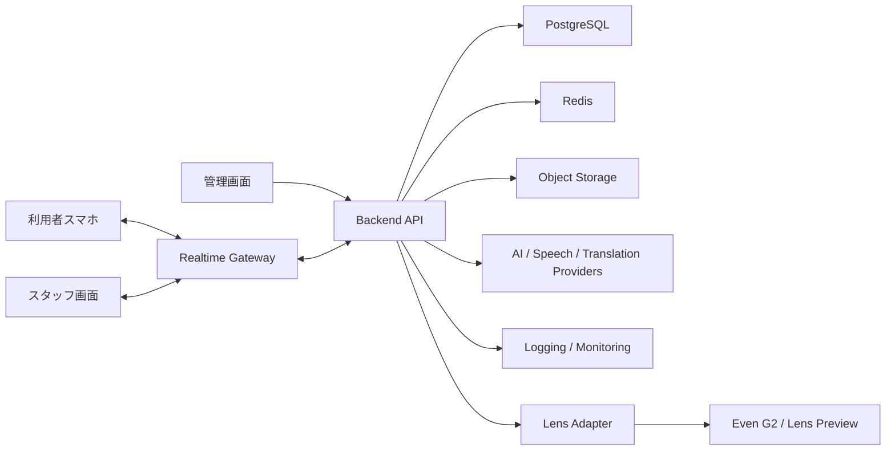

# 本番化設計メモ

## 1. 文書情報

| 項目 | 内容 |
|---|---|
| プロジェクト名 | Mieru Counter |
| 対象 | MVP後の本番化検討 |
| 作成日 | 2026-06-27 |

## 2. 本番化の基本方針

Mieru Counterは、聴覚障害者、難聴者、高齢者の窓口体験に関わるサービスである。

本番化では、単にアプリを公開するだけでなく、以下を重視する。

- 個人情報を必要以上に保存しない
- AI結果をそのまま確定情報にしない
- 施設ごとのデータ分離を徹底する
- セッション中の通信断に強くする
- スタッフが現場で迷わない運用にする
- Even G2に依存しすぎず、スマホ単体でも価値が出る構成にする

## 3. 推奨本番アーキテクチャ



## 4. アプリ構成

### 4.1 利用者アプリ

役割:

- セッション参加
- 字幕表示
- 重要事項カード表示
- 確認ボタン
- 会話メモ確認
- 同意管理

本番化ポイント:

- 文字サイズ変更
- 高コントラスト表示
- 読みやすい日本語
- 通信断時の再接続
- セッション終了後のメモ確認

### 4.2 スタッフ画面

役割:

- セッション作成
- 字幕送信
- 定型文送信
- 重要事項カード確認
- 利用者反応の確認
- 呼び出し通知

本番化ポイント:

- 操作を3クリック以内にする
- よく使う定型文を上に出す
- 「もう一度」などの反応は目立たせる
- AI候補とスタッフ確定情報を明確に分ける

### 4.3 管理画面

役割:

- 施設管理
- スタッフ管理
- 定型文管理
- 保存期間設定
- 利用状況確認
- 監査ログ確認

本番化ポイント:

- 権限管理
- 施設単位のデータ閲覧制限
- 退職スタッフのアクセス停止
- 利用レポートの出力

### 4.4 Lens Adapter

役割:

- Lens PreviewまたはEven G2に表示内容を送る
- アプリ本体からG2固有仕様を隠す

本番化ポイント:

- `MockLensAdapter`
- `EvenG2Adapter`
- `NoopLensAdapter`

を切り替えられるようにする。

アプリ本体は以下の形式だけを扱う。

```ts
type LensMessage = {
  mode: "caption" | "important" | "call" | "confirm";
  title?: string;
  body: string;
  priority: "normal" | "high" | "urgent";
  actions?: string[];
};
```

## 5. インフラ候補

### 5.1 小規模実証向け

- Frontend: Vercel / Cloudflare Pages
- Backend: Render / Fly.io / Railway / AWS App Runner
- DB: Supabase Postgres / Neon / RDS
- Realtime: WebSocketサーバーまたはPusher系サービス
- Storage: S3互換
- Monitoring: Sentry + uptime監視

### 5.2 法人本番向け

- Cloud: AWSまたはGCP
- Frontend: CDN配信
- Backend: コンテナ運用
- DB: マネージドPostgreSQL
- Cache: Redis
- Queue: SQS / PubSub / Cloud Tasks
- Secret管理: Secrets Manager
- Logs: CloudWatch / Datadog
- WAF: Cloudflare / AWS WAF

## 6. 環境分離

最低限、以下を分ける。

| 環境 | 用途 |
|---|---|
| local | 開発 |
| staging | 検証、デモ |
| pilot | 実証実験 |
| production | 本番 |

注意:

- 本番データをlocalへコピーしない
- stagingは匿名データで検証する
- pilotは実証先ごとにデータ分離する

## 7. セキュリティ設計

### 7.1 認証

本番では以下を推奨する。

- スタッフはメール認証またはSSO
- 管理者は多要素認証
- 利用者はセッションURLまたはQRコードで一時参加
- セッションURLには有効期限を設定

### 7.2 認可

ロール:

- owner
- admin
- manager
- staff

アクセス制御:

- staffは自施設のセッションのみ閲覧
- managerは自施設の履歴を閲覧
- adminは組織内施設を管理
- ownerは契約・権限管理を担当

### 7.3 通信

- HTTPS必須
- WebSocketもWSS必須
- セッションURLは推測困難なトークン
- CORSを制限
- 管理画面はIP制限も検討

### 7.4 監査ログ

保存すべき操作:

- ログイン
- セッション作成
- 会話ログ閲覧
- 重要事項カード送信
- データ削除
- スタッフ権限変更
- 定型文変更

## 8. 個人情報・医療情報の扱い

### 8.1 基本方針

- 保存する情報を最小化する
- 利用者の本名は原則保存しない
- 音声データは原則保存しない
- 会話ログ保存には同意を取る
- 保存期間を短く設定できるようにする

### 8.2 同意

同意を分ける。

- 字幕表示のみ
- 会話ログ保存
- AI処理
- 家族共有
- 実証分析利用

### 8.3 削除

本番では以下を用意する。

- セッション単位削除
- 利用者からの削除依頼受付
- 保存期間切れの自動削除
- 削除操作の監査ログ

### 8.4 医療安全

重要事項カードは、AIが作った候補をスタッフが確認してから送る。

画面上の表現:

- AI候補
- スタッフ確認済み
- 送信済み

を明確に区別する。

本サービスは診断や治療判断を行わない。

## 9. AI設計

### 9.1 AIの役割

- 重要事項抽出
- やさしい日本語化
- 翻訳
- 会話メモ要約

### 9.2 AIに任せないこと

- 医療判断
- 服薬指示の勝手な変更
- スタッフ確認なしの確定表示
- 緊急判断

### 9.3 AIプロバイダー抽象化

以下のようにプロバイダーを分離する。

```ts
interface ImportantItemExtractor {
  extract(text: string, context: ExtractionContext): Promise<ImportantItemCandidate[]>;
}

interface TextSimplifier {
  simplify(text: string, target: "easy_ja" | "plain_ja"): Promise<string>;
}

interface Translator {
  translate(text: string, from: string, to: string): Promise<string>;
}
```

### 9.4 AIログ

保存するもの:

- 入力テキストのハッシュ
- 抽出結果
- モデル名
- 処理時間
- エラー

保存を避けるもの:

- 不要な生音声
- 長期保存が不要な全文ログ

## 10. リアルタイム通信

### 10.1 要件

- スタッフ入力から利用者表示まで1秒以内を目標
- セッションごとにチャンネルを分ける
- 切断時は自動再接続
- 再接続時に最新状態を取得

### 10.2 イベント例

| イベント | 内容 |
|---|---|
| transcript.created | 字幕追加 |
| important_item.candidate | 重要事項候補作成 |
| important_item.sent | 重要事項送信 |
| confirmation.created | 利用者確認ボタン |
| call.sent | 呼び出し通知 |
| session.ended | セッション終了 |

### 10.3 障害時

- 利用者画面に「再接続中」を表示
- スタッフ画面に接続状態を表示
- 復帰時に未受信イベントを再取得

## 11. Even G2連携方針

### 11.1 前提

Even G2側のSDKやEven Hubの仕様に依存するため、実装はAdapter層に閉じ込める。

### 11.2 表示方針

G2には以下を出す。

- 短文字幕
- 重要事項1件
- 呼び出し番号
- 確認選択肢

G2に出さないもの:

- 長い会話履歴
- 管理画面
- 複雑な設定
- 複数カードの一覧

### 11.3 フォールバック

G2が使えない場合でも、利用者スマホ画面で同じセッションを継続できるようにする。

## 12. 障害対策

### 12.1 想定障害

| 障害 | 対応 |
|---|---|
| ネットワーク切断 | 自動再接続、最新状態再取得 |
| AI処理失敗 | ルールベースまたは手入力で継続 |
| G2表示失敗 | スマホ画面にフォールバック |
| DB障害 | エラー表示、復旧後再開 |
| スタッフ操作ミス | 重要事項カード編集・取り消し |

### 12.2 バックアップ

- DB日次バックアップ
- 重要設定のバックアップ
- 監査ログの保全
- 復元手順の文書化

## 13. 監視

監視項目:

- APIエラー率
- WebSocket接続数
- 平均表示遅延
- AI処理時間
- DB接続数
- 重要事項抽出失敗率
- G2送信失敗率
- ログイン失敗回数

アラート:

- API 5xx増加
- DB接続失敗
- WebSocket接続不可
- AI処理エラー急増
- 本番デプロイ失敗

## 14. 運用設計

### 14.1 施設導入時

必要作業:

1. 組織作成
2. 施設作成
3. 窓口作成
4. スタッフ招待
5. QRコード設置
6. 定型文登録
7. スタッフ研修
8. テストセッション実施

### 14.2 スタッフ研修

研修内容:

- セッション開始方法
- 利用者への説明
- 定型文の使い方
- 重要事項カードの確認方法
- 「もう一度」通知への対応
- 個人情報の扱い
- トラブル時の対応

### 14.3 サポート

サポート導線:

- 施設管理者向け問い合わせ
- 障害報告フォーム
- よくある質問
- 操作マニュアル
- 実証期間中の定例ヒアリング

## 15. デプロイ方針

### 15.1 CI/CD

本番前に必須:

- 型チェック
- Lint
- 単体テスト
- DB migration dry-run
- E2Eテスト
- セキュリティスキャン

### 15.2 リリース方式

- stagingで確認
- pilotで限定施設に配信
- 問題がなければproductionへ反映

### 15.3 ロールバック

- 直前バージョンへ戻せること
- DB migrationは戻し方を用意する
- 重要機能はfeature flagで無効化できること

## 16. テスト方針

### 16.1 必須テスト

- セッション作成
- 利用者接続
- 字幕送信
- 重要事項抽出
- スタッフ確認
- 確認ボタン
- セッション終了
- 権限管理
- 保存期間削除

### 16.2 E2Eテストシナリオ

薬局シナリオ:

1. スタッフがセッション作成
2. 利用者がQR接続
3. スタッフが服薬説明を入力
4. 重要事項カード候補が出る
5. スタッフが修正して送信
6. 利用者が「理解しました」を押す
7. セッション終了
8. 会話メモが残る

## 17. コスト設計

主なコスト:

- サーバー
- DB
- リアルタイム通信
- AI API
- 音声認識API
- 監視ツール
- サポート運用
- 端末レンタル

コストを抑える方針:

- MVPでは音声保存しない
- AI処理は重要事項抽出時だけ実行
- 長文履歴の保存期間を短くする
- 実証先ごとに利用上限を設定する

## 18. 法人提供時の契約・規約で決めること

技術だけでなく、以下を事前に決める必要がある。

- 利用規約
- プライバシーポリシー
- データ処理契約
- 障害時の責任範囲
- AI誤抽出時の扱い
- 医療判断ではないことの明記
- 保存期間
- 削除依頼対応
- 実証実験同意書

## 19. 本番化までの段階

### Phase 1: Web MVP

- Lens Preview
- スタッフ画面
- 利用者画面
- 重要事項カード
- 手入力字幕

### Phase 2: 実証版

- 音声認識
- 同意管理
- 監査ログ
- 保存期間設定
- 薬局または診療所で実証

### Phase 3: 法人パイロット

- 複数施設対応
- スタッフ権限管理
- 定型文管理
- レポート
- サポート体制

### Phase 4: G2実機連携

- Even G2 Adapter
- 表示最適化
- 実機テスト
- スマホフォールバック

### Phase 5: 商用版

- 契約管理
- 請求
- SLA
- セキュリティレビュー
- 導入研修パッケージ

## 20. 重要な意思決定

現時点での推奨:

1. 最初は薬局・診療所に絞る
2. 音声認識より先に、スタッフ手入力と定型文で価値を検証する
3. AI候補は必ずスタッフ確認後に送る
4. G2は表示端末として扱い、主機能はスマホとクラウドに持たせる
5. 本番前に、同意管理・監査ログ・保存期間削除を必ず入れる

## 21. 最大のリスクと対策

| リスク | 対策 |
|---|---|
| 字幕アプリとの差別化が弱い | 重要事項カード、確認ボタン、呼び出し連携を中心にする |
| 現場スタッフの負担が増える | 定型文、候補編集、最小クリック設計 |
| AI誤抽出 | スタッフ確認を必須にする |
| 個人情報リスク | 保存最小化、同意、削除、監査ログ |
| G2仕様依存 | Adapter層で分離し、スマホでも使えるようにする |
| 導入先が見つからない | 薬局・診療所で小さな実証から始める |

## 22. 本番化チェックリスト

- スタッフ認証がある
- 施設ごとの権限分離がある
- セッションURLに有効期限がある
- HTTPS/WSSで通信している
- 同意管理がある
- 保存期間設定がある
- 削除導線がある
- 監査ログがある
- AI候補と確定情報が区別される
- 障害時のフォールバックがある
- バックアップがある
- 操作マニュアルがある
- スタッフ研修資料がある
- 実証先との責任範囲が明確である

