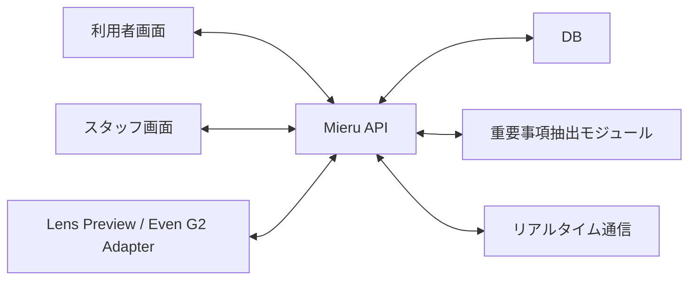

# 要件定義書 MVP

## 1. 文書情報

| 項目 | 内容 |
|---|---|
| プロジェクト名 | Mieru Counter |
| 仮称 | 聴覚バリアフリー窓口OS |
| 対象フェーズ | MVP |
| 想定利用場所 | 薬局、診療所、自治体窓口、銀行、ホテルなど |
| 初期ターゲット | 薬局、診療所 |
| 作成日 | 2026-06-27 |
| 最終更新日 | 2026-06-28 |
| 本番URL | https://mieru-counter.vercel.app |

## 2. サービス概要

Mieru Counterは、聴覚障害者、難聴者、高齢者が窓口で会話内容を理解しやすくするためのサービスである。

単なるリアルタイム字幕アプリではなく、窓口で重要になる情報を抽出し、利用者が理解確認でき、スタッフ側にも状況が伝わる仕組みを提供する。

Even G2などのスマートグラスは、利用者が目線を大きく下げずに情報を確認するための表示端末として扱う。MVPでは実機連携が未確定でも動作確認できるよう、Web上にLens Previewを用意する。

## 3. MVPの目的

MVPの目的は、以下を検証することである。

1. 窓口会話をリアルタイムに字幕表示する体験が有効か
2. 会話から重要事項カードを作る機能に価値があるか
3. 利用者の「理解しました」「もう一度」などの意思表示が、スタッフ対応を改善するか
4. Even G2相当の小さな表示領域でも、実用的な情報提示ができるか
5. 薬局・診療所の現場に導入できる業務フローになるか

## 4. MVPの基本方針

- G2実機連携より先に、Webで動く検証可能なMVPを作る
- G2側は長文を出さず、「今見るべき一文」だけを表示する
- 長文履歴、会話メモ、設定はスマホ画面に逃がす
- スタッフ側で重要事項を確認・修正してから利用者に送れるようにする
- 初期音声認識はモック入力でもよい
- AI処理は後から差し替えられるよう、抽象化して実装する

## 5. 想定ユーザー

### 5.1 利用者

- 聴覚障害者
- 難聴者
- 高齢により聞こえづらくなった人
- 日本語の説明を理解しづらい外国人
- 騒がしい場所で会話を聞き取りづらい人

### 5.2 スタッフ

- 薬局スタッフ
- 医療事務
- 看護師
- 自治体窓口担当者
- 店舗・ホテル・銀行などの接客担当者

### 5.3 管理者

- 施設管理者
- 薬局チェーン本部
- 自治体の窓口DX担当者
- 法人のバリアフリー推進担当者

## 6. 利用シーン

### 6.1 初期MVPで重視するシーン

薬局での服薬説明を最優先ユースケースとする。

理由は以下の通り。

- 薬の飲み方、回数、時間、注意事項など、重要事項が明確
- 聞き逃しによる不安やミスの影響が大きい
- スタッフ側も説明内容を定型化しやすい
- MVPの効果測定がしやすい

### 6.2 具体例

1. 利用者が薬局受付のQRコードを読み込む
2. スマホ画面とLens Previewがセッションに接続される
3. スタッフが説明内容を入力する
4. 利用者画面とLens Previewに短文字幕が表示される
5. システムが「薬は1日3回、食後」「次回は7月15日」などを抽出する
6. スタッフが重要事項カードを確認・修正する
7. 利用者側に重要事項カードが表示される
8. 利用者が「理解しました」または「もう一度」を押す
9. スタッフ側に利用者の反応が表示される
10. 会話メモが保存され、あとで見返せる

## 7. MVP対象範囲

### 7.1 MVPで作るもの

- 利用者画面
- スタッフ画面
- Lens Preview
- 窓口セッション作成
- リアルタイム字幕表示
- 重要事項カード作成
- 重要事項カードの編集・送信
- 利用者の確認ボタン
- 会話ログ保存
- 定型文送信
- 簡易管理画面
- DB保存
- AI差し替え前提の抽出モジュール

### 7.2 MVPで作らないもの

- 医療機関の基幹システム連携
- 電子カルテ連携
- 保険請求システム連携
- 緊急音検知
- 電話字幕
- 多人数会議の完全対応
- 本番Even G2実機連携の完成版
- 本人確認やマイナンバー連携
- 決済機能
- 施設向け詳細分析ダッシュボード
- 医療判断や診断支援

## 8. システム構成



### 8.1 現在のデプロイ構成（MVP）

| 項目 | 技術 |
|---|---|
| フレームワーク | Next.js 16（App Router） |
| ホスティング | Vercel（Hobby） |
| データベース | Supabase PostgreSQL（ap-southeast-2） |
| ORM | Prisma v7（@prisma/adapter-pg） |
| リポジトリ | GitHub（lazo-hitoshi/mieru-counter） |
| デプロイ | mainブランチへのpush時に自動デプロイ |

## 9. 画面要件

### 9.1 利用者画面

利用者がスマホで見る画面。

必要機能:

- セッション接続状態の表示
- 現在の字幕表示
- 重要事項カード一覧
- 確認ボタン
- 文字で伝える（双方向テキスト入力）
- 会話メモ表示
- 表示文字サイズ設定
- 使い方ガイド（？ボタン）
- ホームへの戻りボタン
- セッション終了

確認ボタン:

- 理解しました
- もう一度お願いします
- ゆっくりお願いします
- 文字でください
- 手話通訳が必要です

### 9.2 スタッフ画面

窓口スタッフがPCまたはタブレットで使う画面。

必要機能:

- 接続中セッション一覧
- 選択中セッションの字幕ログ
- テキスト入力欄
- 定型文送信
- 重要事項カードの候補表示
- 重要事項カードの編集
- 重要事項カードの送信
- 利用者からの確認ボタン通知
- 利用者からのテキストメッセージ表示
- 接続コード共有（QRコード＋大文字表示）
- 呼び出し番号送信
- 使い方ガイド（？ボタン）
- ホームへの戻りボタン
- セッション終了

### 9.3 Lens Preview

Even G2相当の表示をWeb上で再現する画面。

制約:

- 表示は小さくする
- 長文を出さない
- 情報は1画面1メッセージを基本とする
- 優先度が高い情報を目立たせる

表示モード:

- caption: 短文字幕
- important: 重要事項
- call: 呼び出し番号
- confirm: 確認選択肢

### 9.4 管理画面

MVPでは最小限とする。

必要機能:

- 組織情報の表示
- 施設情報の表示
- 窓口一覧
- スタッフ一覧
- 定型文管理
- セッション履歴の簡易確認

## 10. 機能要件

### F-001 セッション作成

スタッフは窓口ごとに利用者セッションを作成できる。

受け入れ条件:

- セッションIDが発行される
- QRコードまたは接続URLが生成される
- セッション状態がactiveになる

### F-002 利用者セッション接続

利用者はURLまたはQRコードからセッションに参加できる。

受け入れ条件:

- 接続後、利用者画面に施設名と窓口名が表示される
- スタッフ画面に利用者接続状態が表示される

### F-003 スタッフ入力による字幕送信

スタッフはテキスト入力欄から会話文を送信できる。

受け入れ条件:

- 入力内容が利用者画面に表示される
- Lens Previewにも短文化された内容が表示される
- DBに字幕ログとして保存される

### F-004 リアルタイム反映

字幕、重要事項、確認ボタンはリアルタイムに反映される。

受け入れ条件:

- 通常の通信状態で1秒以内に画面反映される
- 接続切断時は再接続を試みる

### F-005 重要事項抽出

会話テキストから重要事項候補を抽出できる。

抽出対象:

- 日付
- 時間
- 薬の飲み方
- 回数
- 金額
- 場所
- 持ち物
- 注意事項
- 次にやること

受け入れ条件:

- 抽出処理は`extractImportantItems(text)`として独立している
- 初期実装はルールベースでよい
- 後からAI APIに差し替え可能である

### F-006 重要事項カード編集

スタッフは重要事項カード候補を編集できる。

受け入れ条件:

- タイトル、本文、種別、優先度を編集できる
- 送信前は利用者に確定表示されない

### F-007 重要事項カード送信

スタッフは確認済みの重要事項カードを利用者へ送信できる。

受け入れ条件:

- 利用者画面にカードが追加される
- Lens Previewに要約された1件が表示される
- DBに送信済みとして保存される

### F-008 確認ボタン

利用者は確認ボタンで意思表示できる。

受け入れ条件:

- 押下内容がスタッフ画面に即時表示される
- DBにイベントとして保存される
- 重要度の高い反応はスタッフ画面で目立つ

### F-009 定型文送信

スタッフは登録済み定型文を送信できる。

受け入れ条件:

- カテゴリ別に定型文を表示できる
- 送信すると字幕ログに残る
- 必要に応じて重要事項カード候補にもなる

### F-010 呼び出し番号表示

スタッフは呼び出し番号を利用者画面とLens Previewに送信できる。

受け入れ条件:

- 番号と窓口名を表示できる
- Lens Previewでは他の字幕より優先表示される

### F-011 会話メモ保存

セッション終了後、利用者は会話メモを確認できる。

受け入れ条件:

- 字幕ログ
- 重要事項カード
- 確認ボタン履歴
- セッション日時

を確認できる。

### F-012 利用者テキスト入力

話すことが難しい利用者がテキストでスタッフにメッセージを送信できる。

受け入れ条件:

- 利用者画面に「文字で伝える」トグルボタンがある
- テキスト入力して送信するとスタッフ画面に表示される
- スタッフ画面では「利用者」ラベル付きで表示される
- 利用者画面では「あなたのメッセージ」ラベル付きで表示される
- 会話メモにも記録される

### F-013 接続コード共有

スタッフはQRコードまたは大文字表示で接続コードを利用者に共有できる。

受け入れ条件:

- スタッフ画面に「📲 共有」ボタンがある
- QRコードを表示できる
- QRコード読み取りで利用者画面にコードが自動入力される
- 大きな文字でコードを表示できる（スマホ非所持者向け）
- 「両方表示」「QRコードのみ」「コードのみ」を切り替えられる

### F-014 使い方ガイド

各画面に使い方ガイド機能がある。

受け入れ条件:

- 各画面の右下に「？」ボタンが表示される
- タップするとステップ形式のガイドモーダルが表示される
- ステップの前後移動ができる
- 画面ごとに適切な内容が表示される

### F-015 セッション終了

スタッフまたは利用者はセッションを終了できる。

受け入れ条件:

- セッション状態がendedになる
- 新規メッセージ送信は停止される
- 会話メモが保存される

### F-016 LensDisplayAdapter

G2表示ロジックはアプリ本体から分離する。

必須インターフェース:

```ts
type LensMessage = {
  mode: "caption" | "important" | "call" | "confirm";
  title?: string;
  body: string;
  priority: "normal" | "high" | "urgent";
  actions?: string[];
};

interface LensDisplayAdapter {
  send(message: LensMessage): Promise<void>;
  clear(): Promise<void>;
}
```

実装:

- MockLensAdapter
- EvenG2Adapterは将来実装

## 11. 非機能要件

### 11.1 表示速度

- スタッフ入力から利用者画面表示まで通常1秒以内
- Lens Preview表示まで通常1秒以内
- 重要事項抽出は3秒以内を目標とする

### 11.2 可用性

MVPでは商用SLAは設定しない。

本番化時の目標:

- 月間稼働率99.5%以上
- 施設営業時間中の障害通知
- セッション中の自動再接続

### 11.3 セキュリティ

- 施設ごとのデータ分離
- スタッフ認証
- セッションURLの推測困難化
- 通信のHTTPS化
- 監査ログ保存
- 管理者権限とスタッフ権限の分離

### 11.4 個人情報

- MVPでは個人名、診断名、詳細な医療情報の保存を最小化する
- 会話ログ保存には同意を必要とする
- 保存期間を設定できるようにする
- 利用者が会話メモ削除を依頼できる導線を用意する

### 11.5 アクセシビリティ

- 大きな文字
- 高いコントラスト
- 押しやすいボタン
- 操作数を少なくする
- 色だけに依存しない状態表示
- 読みやすい日本語
- スマホ縦画面に最適化

### 11.6 医療安全

- 本サービスは医療判断を行わない
- 診断、治療方針、服薬判断の責任は医療従事者側にある
- AI抽出結果はスタッフ確認後に送信する
- 重要事項カードには「スタッフ確認済み」の状態を持たせる

## 12. データ要件

保存する主なデータ:

- 組織
- 施設
- 窓口
- スタッフ
- セッション
- 字幕ログ
- 重要事項カード
- 確認ボタン履歴
- 定型文
- 呼び出し通知
- 監査ログ

保存を避ける、または最小化するデータ:

- 診断名
- 詳細な病歴
- 本人確認書類
- マイナンバー
- 決済情報

## 13. KPI

MVP検証で見る指標:

- 1セッションあたりの利用時間
- 字幕表示までの遅延
- 重要事項カードの修正率
- 利用者の「もう一度」押下回数
- スタッフの説明時間
- 利用者満足度
- スタッフ負荷
- 会話メモの閲覧率
- 実証後の継続利用意向

## 14. MVP完了条件

以下を満たしたらMVP完了とする。

- スタッフ画面から字幕を送信できる
- 利用者画面にリアルタイム表示される
- Lens PreviewにG2相当の短文表示が出る
- 重要事項カードを生成、編集、送信できる
- 利用者が確認ボタンを押せる
- スタッフ画面に確認ボタン結果が表示される
- セッション履歴がDBに保存される
- 薬局・診療所を想定したデモが通しで実施できる

## 15. リスク

| リスク | 内容 | 対応 |
|---|---|---|
| G2連携仕様変更 | Even G2側のSDK仕様が変わる | LensDisplayAdapterで分離する |
| 誤要約 | AIが重要事項を誤抽出する | スタッフ確認後に送信する |
| 個人情報 | 会話ログに個人情報が含まれる | 同意、保存期間、削除導線を用意する |
| 現場負荷 | スタッフ操作が増える | 定型文、ショートカット、最小操作にする |
| 表示量過多 | G2で読み切れない | 1画面1メッセージにする |

## 16. 今後の拡張候補

- Even G2実機連携
- 音声認識
- AI要約
- 多言語翻訳
- 予約システム連携
- 番号呼び出しシステム連携
- 家族共有
- 自治体向け手続きテンプレート
- 合理的配慮レポート
- 施設別ダッシュボード

